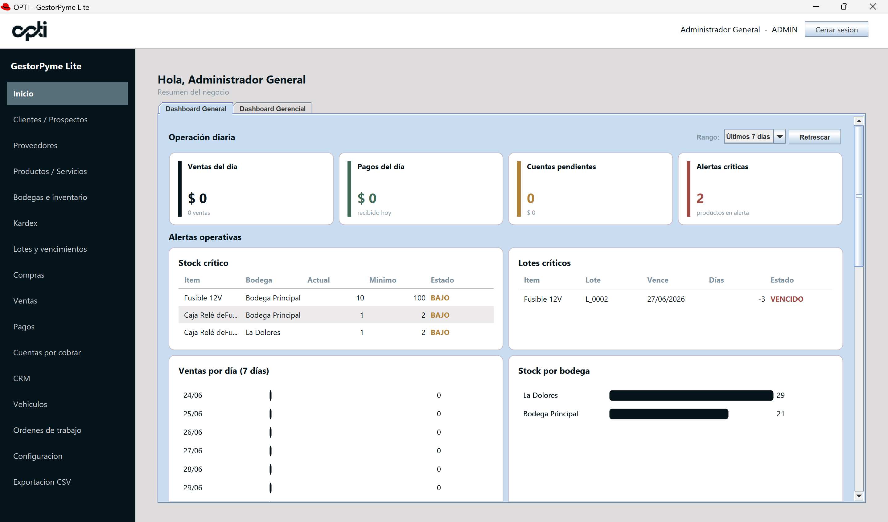
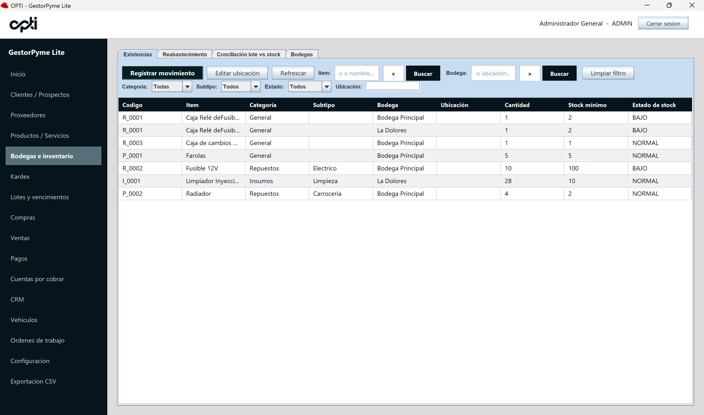
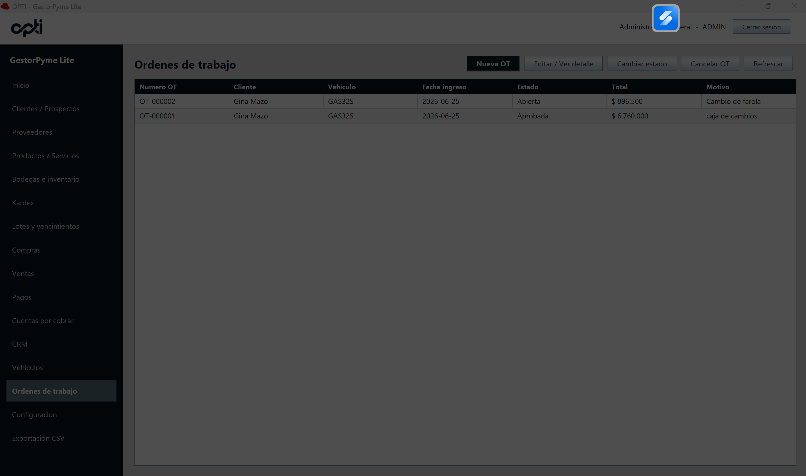
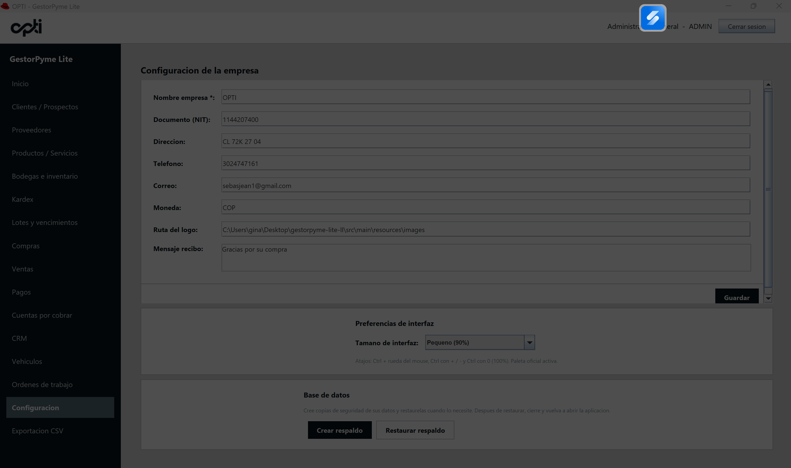

# OPTI - GestorPyme Lite


**OPTI - GestorPyme Lite** es un sistema administrativo tipo **ERP/CRM Lite** desarrollado en **Java**, orientado a pequeñas y medianas empresas que necesitan gestionar clientes, productos, servicios, inventario, ventas, compras, cartera, pagos, órdenes de trabajo, dashboards y reportes CSV desde una aplicación de escritorio **offline-first** con base de datos local SQLite.

El proyecto nace como una solución académica/profesional con enfoque en empresas de operación, logística, comercio y talleres automotrices, aplicando principios de **Programación Orientada a Objetos**, arquitectura **MVC**, persistencia local, validaciones de negocio, trazabilidad e interfaz visual tipo dashboard.

---

## Tabla de contenido

- [Descripción general](#descripción-general)
- [Problema que resuelve](#problema-que-resuelve)
- [Objetivo del proyecto](#objetivo-del-proyecto)
- [Público objetivo](#público-objetivo)
- [Características principales](#características-principales)
- [Módulos del sistema](#módulos-del-sistema)
- [Tecnologías utilizadas](#tecnologías-utilizadas)
- [Arquitectura del proyecto](#arquitectura-del-proyecto)
- [Estructura de carpetas](#estructura-de-carpetas)
- [Base de datos](#base-de-datos)
- [Capturas de pantalla](#capturas-de-pantalla)
- [Instalación y ejecución local](#instalación-y-ejecución-local)
- [Comandos Maven](#comandos-maven)
- [Estado actual del proyecto](#estado-actual-del-proyecto)
- [Roadmap](#roadmap)
- [Aprendizajes técnicos](#aprendizajes-técnicos)
- [Valor profesional del proyecto](#valor-profesional-del-proyecto)
- [Consideraciones de publicación en GitHub](#consideraciones-de-publicación-en-github)
- [Autor](#autor)
- [Licencia / nota académica](#licencia--nota-académica)
- [Mejoras recomendadas para GitHub](#mejoras-recomendadas-para-github)

---

## Descripción general

**GestorPyme Lite** es una aplicación de escritorio construida con **Java Swing** y **SQLite**, diseñada para centralizar procesos administrativos básicos de una pyme.

El sistema permite registrar y consultar información operativa como:

- Clientes, prospectos y proveedores.
- Productos, servicios, repuestos e insumos.
- Bodegas e inventario.
- Compras y recepción de mercancía.
- Ventas de contado y crédito.
- Pagos y cuentas por cobrar.
- Kardex y movimientos de inventario.
- Lotes y trazabilidad FEFO.
- Dashboard general y gerencial.
- Exportaciones CSV.
- Vehículos y órdenes de trabajo para talleres.
- Respaldo y restauración de base de datos local.

La aplicación está pensada para funcionar inicialmente en modo **offline**, con una base SQLite local, y con posibilidad de evolución futura hacia una versión web, multi-PC o integrada con servicios externos.

---

## Problema que resuelve

Muchas pequeñas empresas, talleres y negocios operativos gestionan sus procesos en hojas de cálculo, cuadernos, mensajes o sistemas aislados. Esto puede generar problemas como:

- Falta de trazabilidad en ventas, compras e inventario.
- Dificultad para conocer existencias reales por bodega.
- Poca visibilidad sobre cuentas por cobrar y abonos.
- Ausencia de control sobre lotes, vencimientos y Kardex.
- Procesos manuales para reportes, compras y seguimiento.
- Pérdida de información por falta de respaldos.
- Dificultad para relacionar cliente, vehículo, servicio, repuestos y venta en talleres automotrices.

**OPTI - GestorPyme Lite** busca apoyar estos procesos con una solución local, estructurada y extensible.

---

## Objetivo del proyecto

Desarrollar un sistema administrativo modular que permita aplicar conocimientos de:

- Java y Programación Orientada a Objetos.
- Arquitectura MVC.
- Persistencia con SQLite.
- SQL y diseño de bases de datos.
- Interfaces gráficas con Java Swing.
- Lógica de negocio empresarial.
- Trazabilidad de inventario.
- Gestión operativa tipo ERP/CRM.
- Documentación técnica y preparación de proyecto para portafolio profesional.

---

## Público objetivo

El sistema está orientado a:

- Pequeñas y medianas empresas.
- Negocios comerciales con inventario.
- Talleres automotrices.
- Empresas de operación y logística.
- Emprendimientos que necesitan control administrativo local.
- Estudiantes y desarrolladores que desean estudiar una arquitectura MVC aplicada a un caso empresarial real.

---

## Características principales

- Aplicación de escritorio desarrollada en Java.
- Interfaz gráfica construida con Java Swing.
- Base de datos local SQLite.
- Arquitectura MVC por capas.
- Operación offline-first.
- Gestión de clientes, prospectos y proveedores.
- Gestión de productos, servicios, repuestos e insumos.
- Control de bodegas e inventario.
- Kardex de movimientos.
- Manejo de lotes y vencimientos.
- Ventas con productos y servicios.
- Ventas a crédito y cuentas por cobrar.
- Registro de pagos y abonos.
- Compras y recepción de mercancía.
- Dashboard general y gerencial.
- Exportaciones CSV con separador `;`.
- Respaldo y restauración de base de datos.
- Módulo de vehículos por cliente.
- Módulo de órdenes de trabajo para talleres automotrices.
- Cierre de orden de trabajo hacia venta, inventario, pago o cartera.
- Pruebas automatizadas con Maven.

---

## Módulos del sistema

### Login / autenticación

Permite el acceso inicial al sistema mediante usuario y contraseña.

Incluye:

- Usuario administrador inicial.
- Validación de credenciales.
- Seguridad básica con hash de contraseña.
- Preparación para evolución futura hacia roles y permisos.

### Configuración de empresa

Permite registrar información básica de la empresa.

Incluye:

- Nombre de empresa.
- Documento o NIT.
- Dirección.
- Teléfono.
- Correo.
- Moneda.
- Ruta de logo.
- Mensaje para recibos.

También incluye secciones para:

- Preferencias de interfaz.
- Base de datos.
- Información del sistema.

### Preferencias de interfaz

Permite ajustar la escala visual de la aplicación.

Incluye:

- Tamaño pequeño.
- Tamaño normal.
- Tamaño grande.
- Tamaño muy grande.
- Tamaño máximo.
- Atajos de teclado y mouse para zoom visual.

### Base de datos / respaldo

Permite proteger la base SQLite local.

Incluye:

- Crear respaldo de la base de datos.
- Restaurar respaldo.
- Mensajes de advertencia antes de reemplazar la base actual.
- Recomendación de reiniciar la aplicación después de restaurar.

### Clientes y prospectos

Permite administrar terceros comerciales.

Incluye:

- Registro de clientes.
- Registro de prospectos.
- Datos de contacto.
- Estado activo/inactivo.
- Búsqueda y actualización de información.

### Proveedores

Permite administrar proveedores para el flujo de compras.

Incluye:

- Registro de proveedor.
- Documento.
- Teléfono.
- Correo.
- Dirección.
- Estado.

### CRM / seguimientos

Permite registrar seguimientos comerciales o administrativos.

Incluye:

- Seguimientos por cliente o prospecto.
- Tipo de seguimiento.
- Estado.
- Descripción.
- Historial básico de contacto.

### Productos, servicios y repuestos

Permite administrar el catálogo de ítems.

Incluye:

- Productos inventariables.
- Servicios.
- Mano de obra.
- Repuestos.
- Insumos.
- Categorías.
- Subtipos.
- Unidad de medida.
- Precio de compra.
- Precio de venta.
- Stock mínimo.
- Stock máximo.
- Proveedor preferido.
- Configuración de mano de obra fija o por porcentaje sobre repuestos.

### Bodegas

Permite administrar ubicaciones de almacenamiento.

Incluye:

- Registro de bodegas.
- Estado activo/inactivo.
- Relación con inventario.
- Uso en compras, ventas, recepción y órdenes de trabajo.

### Inventario

Permite consultar existencias por producto y bodega.

Incluye:

- Stock actual.
- Stock mínimo.
- Estado de stock.
- Ubicación interna.
- Filtros por producto, bodega, categoría, subtipo y estado.
- Conciliación lote vs stock.
- Reabastecimiento sugerido.

### Kardex

Permite visualizar movimientos de inventario.

Incluye movimientos como:

- Entradas.
- Salidas.
- Ajustes.
- Entradas por compra.
- Salidas por venta.
- Movimientos asociados a lotes cuando aplica.
- Usuario responsable.
- Motivo del movimiento.

### Lotes y vencimientos

Permite controlar productos por lote.

Incluye:

- Número de lote.
- Fecha de ingreso.
- Fecha de vencimiento.
- Cantidad inicial.
- Cantidad disponible.
- Estado del lote.
- Alertas por vencimiento.
- Uso de lógica FEFO en ventas.

### Compras

Permite administrar órdenes de compra.

Incluye:

- Crear orden de compra.
- Proveedor.
- Fecha.
- Estado.
- Detalle de productos.
- Bodega destino.
- Cantidad solicitada.
- Cantidad recibida.
- Pendiente por recibir.
- Total.
- Observaciones.

### Recepción de mercancía

Permite recibir productos desde una orden de compra.

Incluye:

- Recepción total o parcial.
- Asociación opcional a lote.
- Fecha de vencimiento.
- Actualización de inventario.
- Kardex de entrada por compra.
- Actualización del estado de la orden de compra.

### Ventas

Permite registrar ventas de productos y servicios.

Incluye:

- Venta de contado.
- Venta a crédito.
- Cliente.
- Productos.
- Servicios.
- Descuentos.
- Bodega de salida por línea.
- Descuento de inventario.
- Consumo FEFO por lote.
- Generación de pagos o cartera según el tipo de venta.

### Pagos

Permite registrar pagos asociados a ventas.

Incluye:

- Medio de pago.
- Valor pagado.
- Referencia.
- Observaciones.
- Integración con ventas de contado.

### Cuentas por cobrar

Permite administrar cartera de ventas a crédito.

Incluye:

- Cuenta por cobrar generada desde venta a crédito.
- Saldo pendiente.
- Valor pagado.
- Abonos.
- Estado de cartera.
- Actualización del saldo con cada abono.

### Dashboard general

Panel operativo con indicadores y accesos visuales.

Incluye:

- Ventas del día.
- Pagos del día.
- Cuentas pendientes.
- Alertas críticas.
- Gráficas operativas.
- Drill-down en algunas métricas.
- Alertas de stock y lotes.
- Diseño responsive.

### Dashboard gerencial

Panel ejecutivo para análisis de negocio.

Incluye:

- Ventas del período.
- Utilidad estimada.
- Margen estimado.
- Cartera pendiente.
- Inventario.
- Compras.
- Lotes.
- Operación.
- Metas gerenciales.
- Exportación gerencial CSV.

### Exportaciones CSV

Permite generar reportes en CSV.

Incluye exportaciones para:

- Clientes.
- Prospectos.
- Proveedores.
- Productos / servicios.
- Inventario.
- Kardex.
- Ventas.
- Detalle de ventas.
- Pagos.
- Cartera.
- Abonos.
- Compras.
- Recepciones.
- Detalle de recepciones.
- Lotes.
- Reabastecimiento.
- CRM.
- Dashboard gerencial.

### Vehículos por cliente

Módulo orientado a talleres automotrices.

Incluye:

- Placa.
- Cliente.
- Marca.
- Línea/modelo.
- Año.
- Color.
- Kilometraje.
- Observaciones.
- Estado activo/inactivo.

Este módulo permite construir el historial futuro de servicios por vehículo.

### Órdenes de trabajo

Módulo para operación de talleres automotrices y servicios técnicos.

Incluye:

- Cliente.
- Vehículo.
- Kilometraje de ingreso.
- Motivo de ingreso.
- Diagnóstico.
- Observaciones.
- Estado de la orden.
- Servicios / mano de obra.
- Repuestos / insumos inventariables.
- Total estimado.
- Cierre y facturación.

La orden de trabajo puede convertirse en una venta real, impactando inventario, FEFO, Kardex, pagos o cartera según corresponda.

---

## Tecnologías utilizadas

| Tecnología | Uso en el proyecto |
|---|---|
| Java 17 | Lenguaje principal |
| Java Swing | Interfaz gráfica de escritorio |
| SQLite | Base de datos local |
| Maven | Gestión de proyecto, compilación y pruebas |
| JDBC | Conexión y operaciones SQL |
| SQL | Consultas, persistencia y reportes |
| JUnit | Pruebas automatizadas |
| Git / GitHub | Control de versiones y portafolio |
| Visual Studio Code | Entorno de desarrollo utilizado |
| CSV | Exportación de reportes |
| POO | Modelado del dominio |
| MVC | Separación por capas |

---

## Arquitectura del proyecto

El sistema sigue una arquitectura por capas basada en MVC:

```text
view
  ↓
controller
  ↓
service
  ↓
repository
  ↓
infrastructure.database
  ↓
SQLite
```

### Descripción de capas

#### `view`

Contiene las interfaces gráficas construidas con Java Swing.

Responsabilidades:

- Formularios.
- Tablas.
- Botones.
- Diálogos.
- Presentación de datos.
- Captura de acciones del usuario.

No debe contener SQL ni reglas de negocio complejas.

#### `controller`

Actúa como intermediario entre la vista y los servicios.

Responsabilidades:

- Recibir acciones desde la UI.
- Delegar operaciones a la capa de servicio.
- Mantener la vista desacoplada de la lógica de negocio.

#### `service`

Contiene reglas de negocio.

Responsabilidades:

- Validaciones.
- Cálculos.
- Coordinación de operaciones.
- Control de flujos empresariales.
- Manejo de transacciones cuando aplica.

#### `repository`

Contiene el acceso a datos mediante JDBC.

Responsabilidades:

- Consultas SQL.
- Inserts.
- Updates.
- Deletes controlados.
- Mapeo entre tablas y modelos.

#### `domain`

Contiene modelos, enums y excepciones del dominio.

Ejemplos:

- Cliente.
- Producto.
- Venta.
- Vehículo.
- Orden de trabajo.
- Estados.
- Excepciones de validación.

#### `infrastructure.database`

Contiene infraestructura de conexión e inicialización de la base de datos.

Responsabilidades:

- Conexión SQLite.
- Inicialización de esquema.
- Migraciones idempotentes.
- Configuración de base local.

---

## Estructura de carpetas

Estructura general del proyecto:

```text
gestorpyme-lite/
├── pom.xml
├── README.md
├── src/
│   ├── main/
│   │   ├── java/
│   │   │   └── com/
│   │   │       └── gestorpyme/
│   │   │           ├── controller/
│   │   │           ├── domain/
│   │   │           │   ├── enums/
│   │   │           │   ├── exception/
│   │   │           │   └── model/
│   │   │           ├── infrastructure/
│   │   │           │   ├── database/
│   │   │           │   └── export/
│   │   │           ├── repository/
│   │   │           ├── service/
│   │   │           ├── util/
│   │   │           └── view/
│   │   │               ├── components/
│   │   │               ├── dashboard/
│   │   │               ├── empresa/
│   │   │               ├── inventario/
│   │   │               ├── taller/
│   │   │               └── ...
│   │   └── resources/
│   └── test/
│       └── java/
│           └── com/
│               └── gestorpyme/
│                   ├── repository/
│                   ├── service/
│                   ├── util/
│                   └── view/
├── docs/
│   ├── screenshots/
│   ├── diagrams/
│   └── ...
└── data/
    └── gestorpyme.db
```

> Nota: la carpeta `data/` contiene la base SQLite local. Para publicar en GitHub se recomienda excluir el archivo real `data/gestorpyme.db`.

---

## Base de datos

El sistema usa **SQLite** como motor de persistencia local.

### Características

- Base de datos local en archivo.
- Operación offline.
- Tablas inicializadas desde Java.
- Migraciones aditivas e idempotentes.
- Uso de claves primarias y relaciones entre entidades.
- Persistencia mediante JDBC y `PreparedStatement`.

### Tablas principales

Entre las tablas principales del sistema se encuentran:

- `usuarios`
- `terceros`
- `items`
- `categorias`
- `subtipos`
- `bodegas`
- `inventario_stock`
- `inventario_movimientos`
- `lotes`
- `ventas`
- `venta_detalles`
- `venta_detalle_lotes`
- `pagos`
- `cuentas_por_cobrar`
- `abonos_cuenta`
- `ordenes_compra`
- `ordenes_compra_detalles`
- `recepciones_mercancia`
- `recepciones_detalles`
- `vehiculos`
- `ordenes_trabajo`
- `orden_trabajo_servicios`
- `orden_trabajo_repuestos`
- `empresa_configuracion`
- `exportaciones_log`
- `crm_seguimientos`
- `dashboard_metas`

---

## Capturas de pantalla


### Dashboard principal



### Inventario



### Orden de trabajo



### Configuración



---

## Instalación y ejecución local

### Requisitos previos

- Java 17 o superior.
- Maven.
- Git.
- Visual Studio Code, IntelliJ IDEA, NetBeans o cualquier IDE compatible con Maven.
- Sistema operativo Windows, Linux o macOS compatible con Java.

### Clonar el repositorio

```bash
git clone https://github.com/Nawnd/OPTI---GestorPyme-Lite.git
cd OPTI---GestorPyme-Lite
```


### Compilar el proyecto

```bash
mvn clean compile
```

### Ejecutar pruebas

```bash
mvn test
```

### Ejecutar la aplicación

```bash
mvn exec:java
```

---

## Comandos Maven

```bash
mvn clean
mvn clean compile
mvn test
mvn exec:java
```

Resultado esperado en el estado actual del proyecto:

```text
BUILD SUCCESS
Tests run: 317
Failures: 0
Errors: 0
Skipped: 0
```

---

## Estado actual del proyecto

El proyecto se encuentra en una etapa de **desarrollo avanzado**, con múltiples módulos funcionales implementados y validados mediante pruebas automatizadas.

### Estado técnico actual

- Compilación Maven exitosa.
- Suite de pruebas automatizadas en verde.
- Aplicación ejecutable localmente.
- Base SQLite local inicializable.
- Arquitectura por capas implementada.
- Módulo de taller en evolución avanzada.
- Sistema preparado para mejoras futuras.

### Funcionalidades implementadas

- Login.
- Configuración de empresa.
- Clientes, prospectos y proveedores.
- CRM.
- Productos, servicios, repuestos e insumos.
- Bodegas.
- Inventario.
- Kardex.
- Lotes y FEFO.
- Compras.
- Recepciones.
- Ventas.
- Pagos.
- Cuentas por cobrar.
- Dashboard general.
- Dashboard gerencial.
- Exportaciones CSV.
- Respaldo y restauración.
- Vehículos.
- Órdenes de trabajo.
- Cierre de OT a venta.

---

## Roadmap

### Implementado

- Autenticación básica.
- CRUD de terceros.
- Gestión de productos y servicios.
- Inventario por bodega.
- Kardex.
- Ventas contado/crédito.
- Pagos.
- Cuentas por cobrar.
- Compras y recepción.
- Lotes y FEFO.
- Dashboard general y gerencial.
- Exportaciones CSV.
- Respaldo/restauración de base de datos.
- Vehículos por cliente.
- Orden de trabajo.
- Cierre de orden de trabajo a venta.

### En desarrollo / próximos pasos

- Mejora visual y organización del módulo Configuración.
- Historial por vehículo.
- Acceso desde OT a la venta generada.
- Filtros avanzados de órdenes de trabajo.
- Exportación específica de órdenes de trabajo.
- Dashboard operativo de taller.
- Cuentas por pagar.
- Selector de período avanzado para reportes.
- Mejora de permisos por rol.

### Planeado a futuro

- Facturación electrónica compatible con normativa colombiana.
- Integración futura con DIAN.
- Exportación Excel.
- Reportes PDF.
- API REST.
- Versión web.
- Modo multi-PC.
- Migración futura a PostgreSQL.
- Integraciones externas.
- IA para análisis operativo, inventario y reportes.

---

## Aprendizajes técnicos

Este proyecto permite demostrar y practicar habilidades en:

- Diseño de software orientado a objetos.
- Arquitectura MVC.
- Separación de responsabilidades por capas.
- Persistencia local con SQLite.
- Consultas SQL y modelado relacional.
- Uso de JDBC y `PreparedStatement`.
- Validaciones de negocio.
- Manejo de transacciones.
- Diseño de interfaces administrativas con Java Swing.
- Gestión de inventario.
- Kardex.
- Lógica FEFO por lotes.
- Cuentas por cobrar.
- Reportes CSV.
- Pruebas automatizadas con Maven.
- Documentación técnica.
- Desarrollo incremental por pasos.
- Refactorización controlada.
- Diseño de módulos ERP/CRM.

---

## Valor profesional del proyecto

**OPTI - GestorPyme Lite** es un proyecto útil para portafolio porque demuestra competencias aplicables a roles como:

- Analista Junior.
- Desarrollador Java Junior.
- Desarrollador de aplicaciones de escritorio.
- Analista de sistemas.
- Data Analyst Junior.
- Auxiliar de TI.
- Soporte técnico funcional.
- Desarrollador de soluciones internas.
- Analista de procesos operativos.

### Habilidades demostradas

- Java.
- Programación Orientada a Objetos.
- SQL.
- SQLite.
- Maven.
- Git/GitHub.
- MVC.
- Diseño de interfaces.
- Modelado de procesos empresariales.
- CRM/ERP.
- Inventario y logística.
- Ventas y cartera.
- Documentación técnica.
- Pruebas automatizadas.
- Razonamiento funcional y técnico.

---

## Consideraciones de publicación en GitHub

Antes de publicar el repositorio, se recomienda excluir:

```text
target/
data/gestorpyme.db
*.db
*.sqlite
*.log
```

También se recomienda incluir un archivo `.gitignore`.

Ejemplo básico:

```gitignore
target/
data/*.db
data/*.sqlite
*.log
.idea/
.vscode/
.DS_Store
```

> Si se desea conservar la carpeta `data/`, se puede incluir un archivo placeholder como `data/.gitkeep`.

---

## Autor

**Jean Sebastián González Mera**

Proyecto académico/profesional desarrollado como parte de un proceso de formación en desarrollo de software, Programación Orientada a Objetos, bases de datos, análisis operativo y construcción de soluciones tipo ERP/CRM para pymes.

**LinkedIn:**  
www.linkedin.com/in/sebastian-gonzalez-especialista-seguros

**GitHub:**  
https://github.com/Nawnd

---

## Licencia / nota académica

Este proyecto fue desarrollado con fines académicos, formativos y de portafolio profesional.

Pendiente definir licencia formal para publicación en GitHub.

Opciones recomendadas:

- MIT License.
- Apache License 2.0.
- Licencia académica personalizada.

---

## Mejoras recomendadas para GitHub

Para mejorar la presentación del repositorio se recomienda:

- Agregar capturas de pantalla reales en `docs/screenshots/`.
- Agregar diagrama de arquitectura en `docs/diagrams/architecture.png`.
- Agregar diagrama entidad-relación en `docs/diagrams/er-model.png`.
- Agregar archivo `.gitignore`.
- Agregar licencia.
- Agregar carpeta `/docs`.
- Agregar ejemplos de uso.
- Agregar datos de prueba no sensibles.
- Agregar GIF corto de navegación.
- Agregar guía de instalación paso a paso.
- Agregar diagrama del flujo `Cliente -> Vehículo -> OT -> Venta -> Inventario -> Pago/Cartera`.
- Agregar sección de preguntas frecuentes.
- Agregar sección de decisiones técnicas.
- Agregar sección de pruebas automatizadas.
- Agregar enlace a documentación académica del proyecto.
