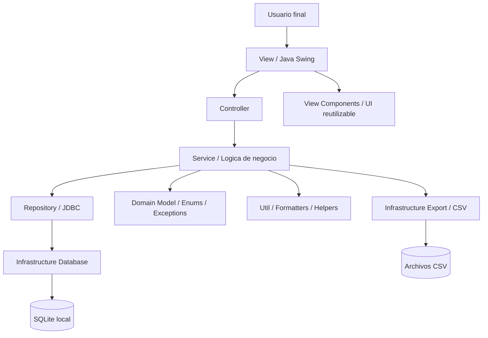
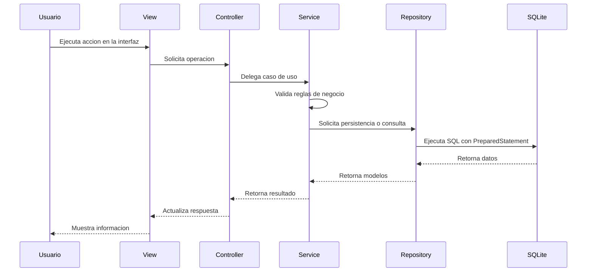
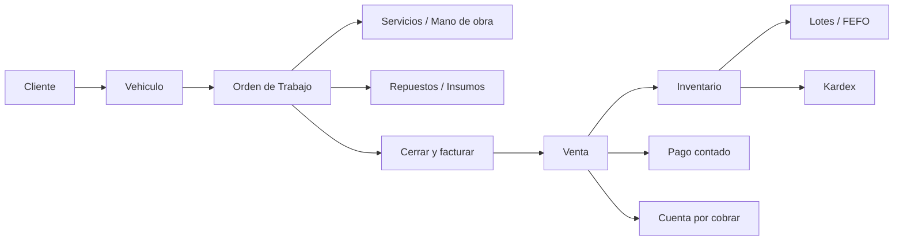
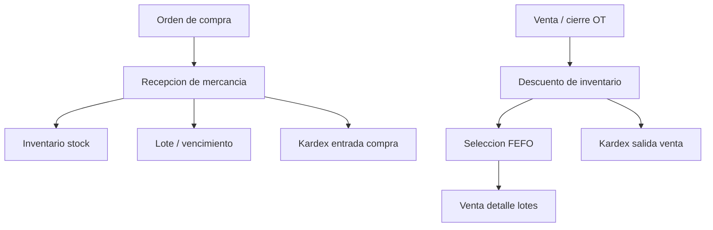
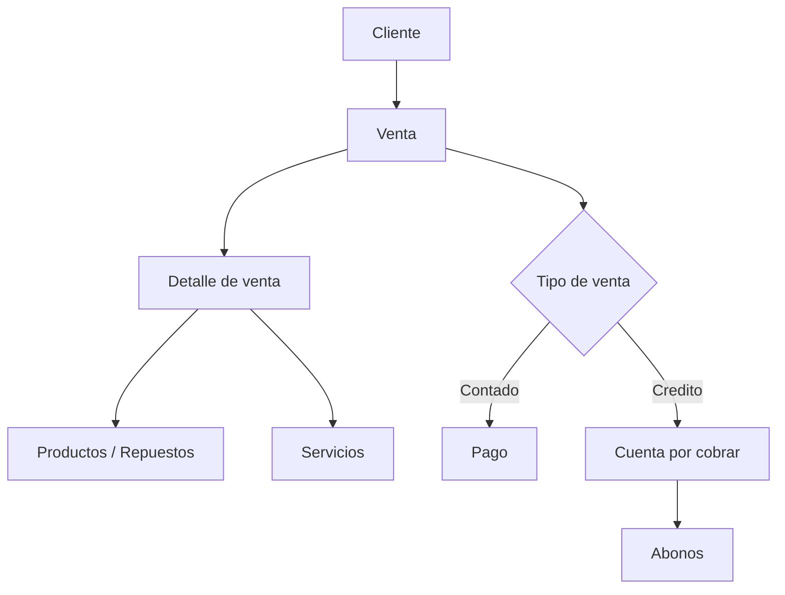
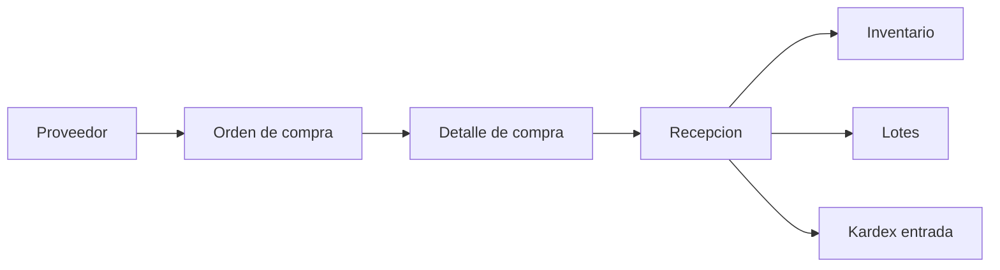
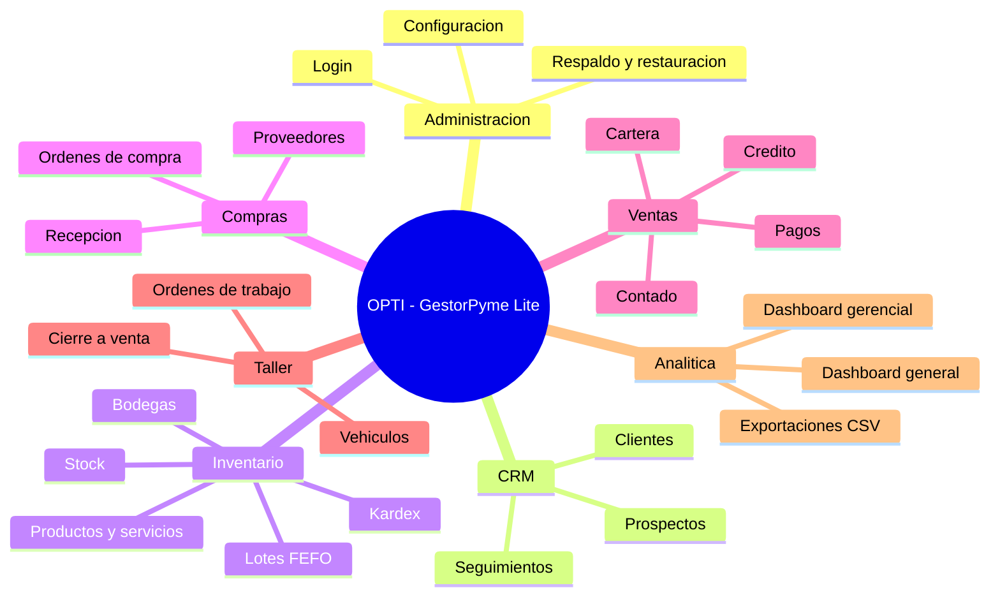

# Diagrama de arquitectura — OPTI - GestorPyme Lite

Este documento resume la arquitectura principal de **OPTI - GestorPyme Lite**, un sistema administrativo / ERP / CRM Lite desarrollado en Java, Java Swing, SQLite y Maven.

El proyecto usa una arquitectura por capas basada en MVC, separando interfaz gráfica, controladores, lógica de negocio, acceso a datos e infraestructura de persistencia.

> GitHub puede renderizar diagramas Mermaid directamente dentro de archivos Markdown usando bloques de código con el identificador `mermaid`.

---

## 1. Arquitectura general por capas

---

## 2. Flujo MVC simplificado

---

## 3. Responsabilidad de capas

### View

Contiene las interfaces gráficas construidas con Java Swing.

Responsabilidades principales:

- Formularios.
- Tablas.
- Botones.
- Diálogos.
- Paneles tipo dashboard.
- Captura de acciones del usuario.

Regla de arquitectura:

- No ejecutar SQL.
- No concentrar reglas de negocio complejas.

---

### Controller

Actúa como intermediario entre la vista y los servicios.

Responsabilidades principales:

- Recibir acciones desde la interfaz.
- Delegar operaciones a la capa de servicio.
- Evitar que la vista conozca detalles internos de negocio o persistencia.

---

### Service

Contiene la lógica de negocio.

Responsabilidades principales:

- Validaciones.
- Cálculos.
- Reglas empresariales.
- Coordinación de transacciones.
- Flujo de ventas, inventario, compras, cartera, órdenes de trabajo y reportes.

---

### Repository

Contiene el acceso a datos mediante JDBC.

Responsabilidades principales:

- Consultas SQL.
- Inserciones.
- Actualizaciones.
- Lectura de entidades.
- Mapeo entre tablas SQLite y modelos Java.

---

### Infrastructure Database

Contiene la conexión e inicialización de la base de datos.

Responsabilidades principales:

- Conexión SQLite.
- Inicialización del esquema.
- Migraciones idempotentes.
- Preparación de la base local.

---

### Domain

Contiene los modelos, enums y excepciones del negocio.

Ejemplos:

- Cliente / tercero.
- Producto / servicio / repuesto.
- Venta.
- Pago.
- Cuenta por cobrar.
- Vehículo.
- Orden de trabajo.
- Lote.
- Kardex.
- Estados y tipos de operación.

---

### Util

Contiene utilidades transversales.

Ejemplos:

- Formato de dinero.
- Formato de fechas.
- Conversión de valores.
- Hash de contraseñas.
- Parseo numérico.

---

## 4. Flujo operativo de taller

El módulo de taller integra cliente, vehículo, orden de trabajo, venta, inventario, lotes, Kardex y pagos/cartera.

---

## 5. Flujo de inventario y lotes

---

## 6. Flujo comercial y financiero

---

## 7. Flujo de compras y recepción

---

## 8. Mapa de módulos principales

---

## 9. Decisiones arquitectónicas relevantes

- Arquitectura MVC por capas.
- SQLite como base de datos local offline-first.
- JDBC con `PreparedStatement`.
- Separación entre lógica de negocio y presentación.
- Servicios como capa principal de reglas empresariales.
- Repositorios como única capa con SQL.
- Migraciones idempotentes desde la infraestructura de base de datos.
- Inventario controlado desde operaciones transaccionales.
- FEFO aplicado al consumo de lotes.
- Orden de trabajo como documento operativo antes de convertirse en venta.
- Cierre de orden de trabajo delegando en el flujo existente de ventas.

---

## 10. Estado actual de la arquitectura

La arquitectura soporta módulos de:

- Autenticación.
- Configuración de empresa.
- Clientes, prospectos y proveedores.
- CRM.
- Productos, servicios, repuestos e insumos.
- Bodegas e inventario.
- Kardex.
- Lotes y FEFO.
- Compras y recepción.
- Ventas.
- Pagos.
- Cuentas por cobrar.
- Dashboard general y gerencial.
- Exportaciones CSV.
- Respaldo y restauración.
- Vehículos.
- Órdenes de trabajo.
- Cierre de OT a venta.

---

## 11. Próximas mejoras documentales sugeridas

- Crear diagrama entidad-relación resumido.
- Agregar diagrama del flujo completo de orden de trabajo.
- Agregar guía de uso funcional.
- Agregar decisiones técnicas principales.
- Agregar preguntas frecuentes.
