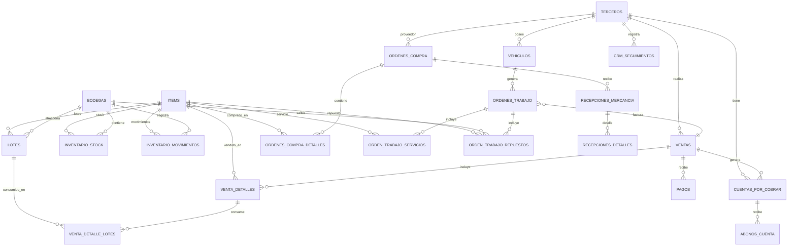
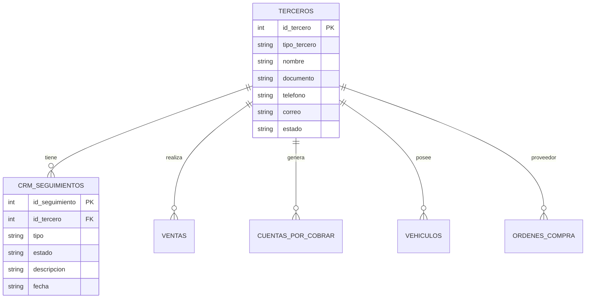
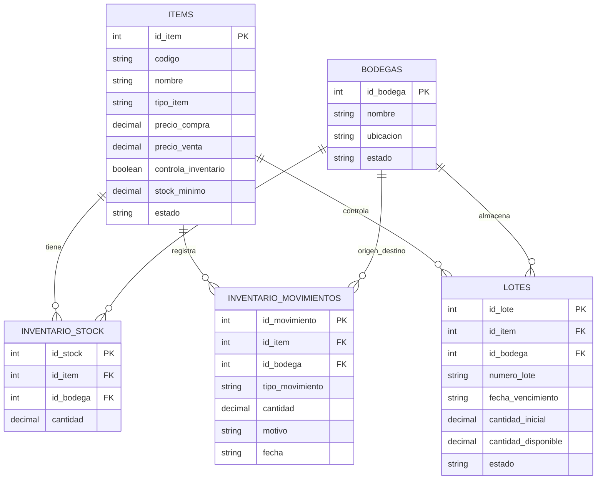
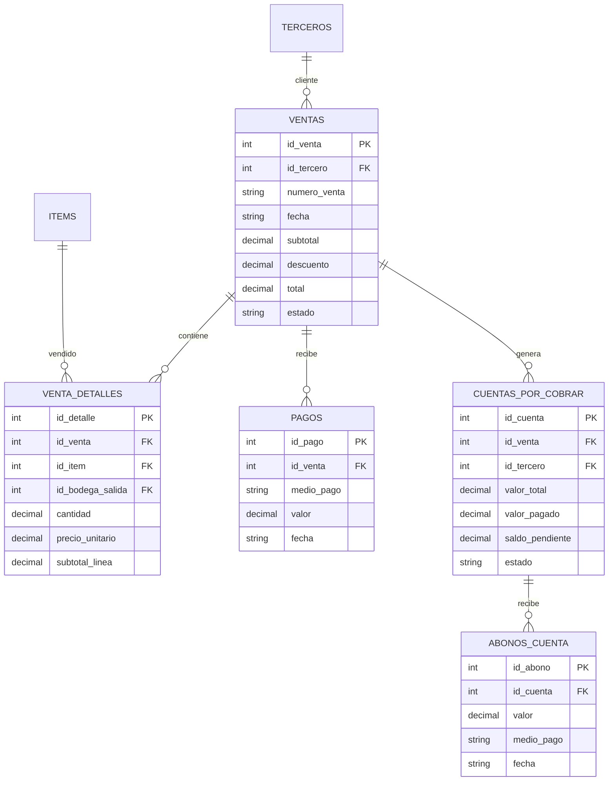
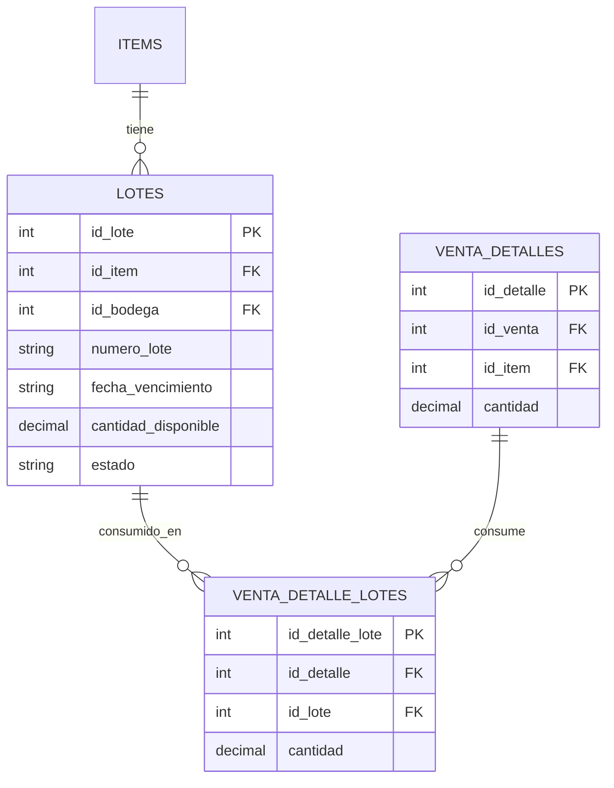
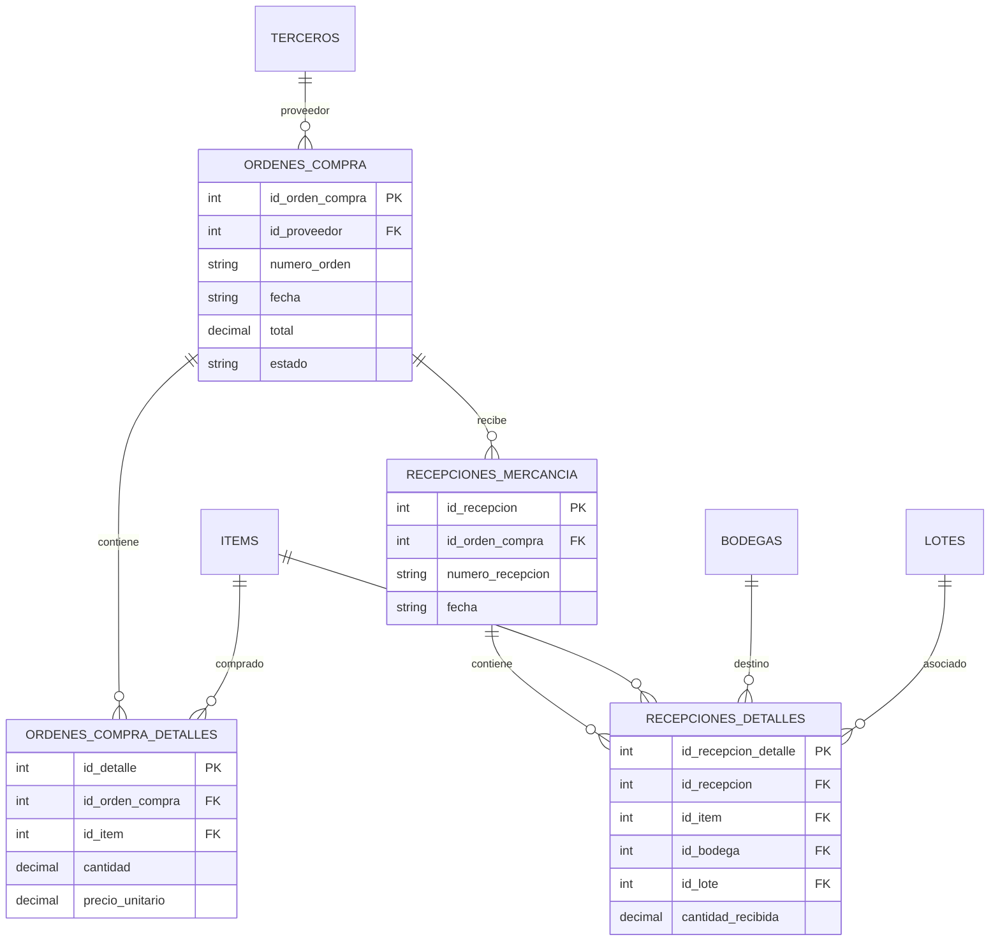
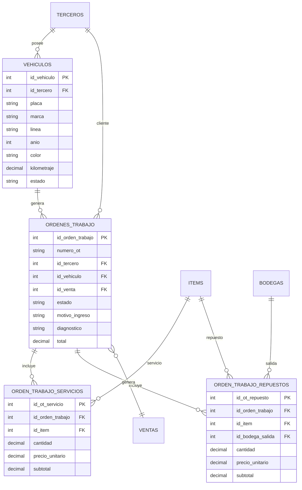

# Modelo entidad-relación resumido — OPTI - GestorPyme Lite

Este documento presenta un modelo entidad-relación resumido de **OPTI - GestorPyme Lite**.

El objetivo no es listar todos los campos de todas las tablas, sino mostrar las relaciones principales entre módulos: clientes, ventas, inventario, compras, pagos, cartera, lotes, vehículos y órdenes de trabajo.

---

## 1. Vista general del modelo

---

## 2. Núcleo CRM / terceros

### Explicación

La tabla `terceros` centraliza clientes, prospectos y proveedores. Desde esta tabla se conectan ventas, cartera, compras, CRM y vehículos.

---

## 3. Productos, inventario, bodegas y Kardex

### Explicación

`inventario_stock` representa la existencia disponible por ítem y bodega. `inventario_movimientos` funciona como Kardex. `lotes` permite trazabilidad por vencimiento y consumo FEFO.

---

## 4. Ventas, pagos y cartera

### Explicación

Una venta puede ser de contado o crédito. Si es contado, genera pago. Si es crédito, genera cuenta por cobrar y posteriormente puede recibir abonos.

---

## 5. Lotes y consumo FEFO

### Explicación

Cuando una venta consume productos con lote, el sistema registra qué lote fue usado. La lógica FEFO prioriza los lotes con vencimiento más próximo.

---

## 6. Compras y recepción

### Explicación

Las órdenes de compra permiten solicitar mercancía a proveedores. La recepción actualiza inventario, puede crear o asociar lotes y genera movimientos de Kardex de entrada.

---

## 7. Vehículos y órdenes de trabajo

### Explicación

El módulo de taller permite relacionar cliente, vehículo, servicios, repuestos y venta. La orden de trabajo inicia como documento operativo y al cerrarse se convierte en una venta real.

---

## 8. Consideraciones del modelo

- `terceros` centraliza clientes, prospectos y proveedores.
- `items` centraliza productos, servicios, repuestos e insumos.
- `inventario_stock` representa el disponible por bodega.
- `inventario_movimientos` funciona como Kardex.
- `lotes` permite trazabilidad FEFO.
- `ventas` integra productos, servicios, pagos y cartera.
- `ordenes_trabajo` conecta operación de taller con ventas e inventario.
- `ordenes_compra` y `recepciones` alimentan inventario y lotes.
- El sistema usa SQLite local con migraciones aditivas e idempotentes.

---

## 9. Próximas mejoras del modelo

- Agregar cuentas por pagar.
- Agregar historial avanzado por vehículo.
- Agregar exportación específica de órdenes de trabajo.
- Agregar dashboard operativo de taller.
- Agregar facturación electrónica en una futura versión.